# event-scheduler

## Overview

The Event Scheduler project is a simple software application designed to help users manage their events and schedules effectively. It provides a user-friendly interface for creating, viewing, and managing events in a calendar format. The project is implemented using Java and JavaFX for the graphical user interface.

The key components of the Event Scheduler project are as follows:

* EventManager: This class serves as the central component for managing events. 
It handles operations such as creating new events, retrieving events based on different criteria (e.g., month, day), and maintaining a list of upcoming events.

* EventModel: The EventModel class represents an individual event. 
It contains information about the event, including the date and time, location, duration, and any additional details. 
It also provides methods for accessing and modifying the event attributes.

* CalendarController: The CalendarController class acts as the controller in the Model-View-Controller (MVC) architecture. 
It handles user interactions with the calendar view, including navigating between months, creating new events, and displaying event details. 
It also updates the calendar view based on changes in the event data.

* EventController: The EventController class is responsible for managing the event creation window. 
It communicates with the EventManager to add new events to the system and updates the event list accordingly.

* EventDetailController: The EventDetailController class handles the event detail window, which displays information about a specific event. 
It allows users to view and modify event details, such as the date, time, location, and duration.

* ConnectionDB: The ConnectionDB class is responsible for connecting to the mongoDB database.

## Getting started

To run the Event Scheduler application, you need to have Java 17 installed on your computer. 
You can download the latest version of Java from the [official website](https://www.oracle.com/java/technologies/downloads/).

You also need to have the JavaFX SDK installed on your computer.
You can download the latest version of JavaFX from the [official website](https://gluonhq.com/products/javafx/).

To get connected to the mongoDB database, you need to have a [mongoDB atlas](https://www.mongodb.com/atlas/database) account or a local mongoDB server running on your computer.
You should also have a database named "EventScheduler" and a collection named "events" in your mongoDB database.
To connect to the database, you need to create a file named "db.properties" in the "src/main/resources" directory.
The file should contain the following information:

```
mongodb.uri=<your-mongodb-uri>
```

To run the application, you can use the following command:

```
java --module-path <path-to-javafx-sdk> --add-modules javafx.controls,javafx.fxml -jar EventScheduler.jar
```

## Screenshots

Main window of the Event Scheduler application is calendar view: 
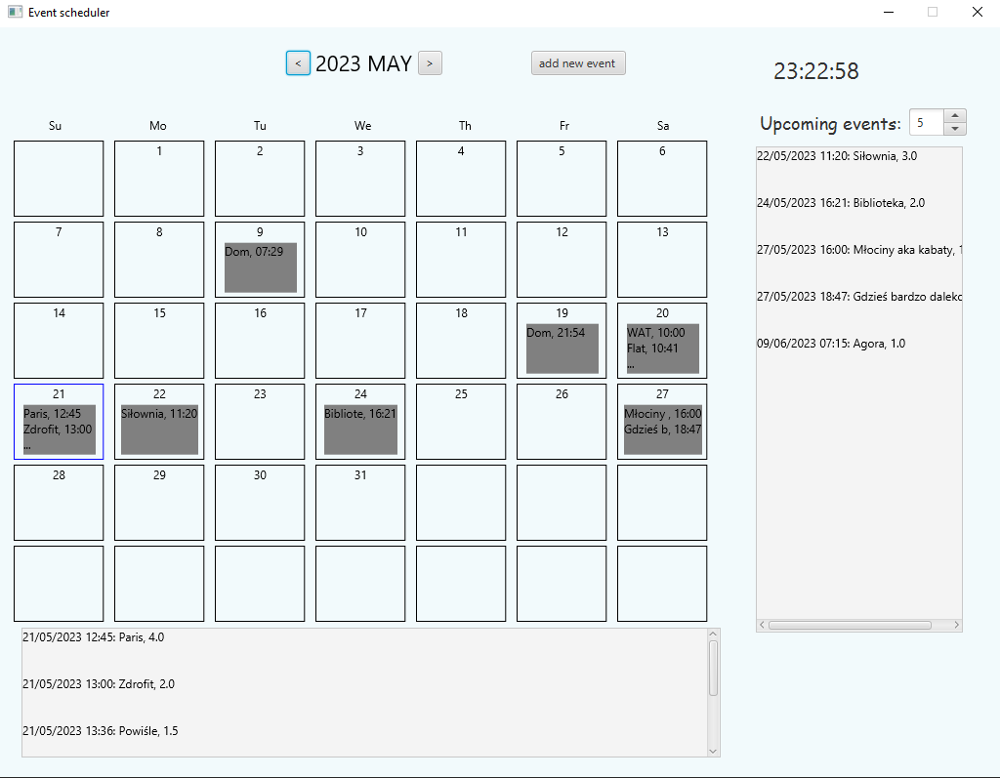
The calendar view displays the current month and allows users to navigate between months.
This view also shows the list of upcoming events: 
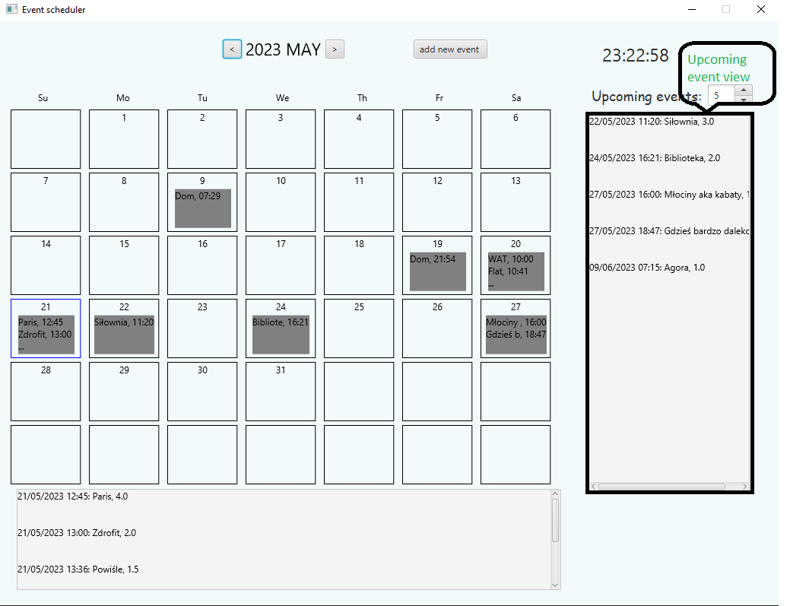
Users can click on '...' to view whole list of events in one day: 
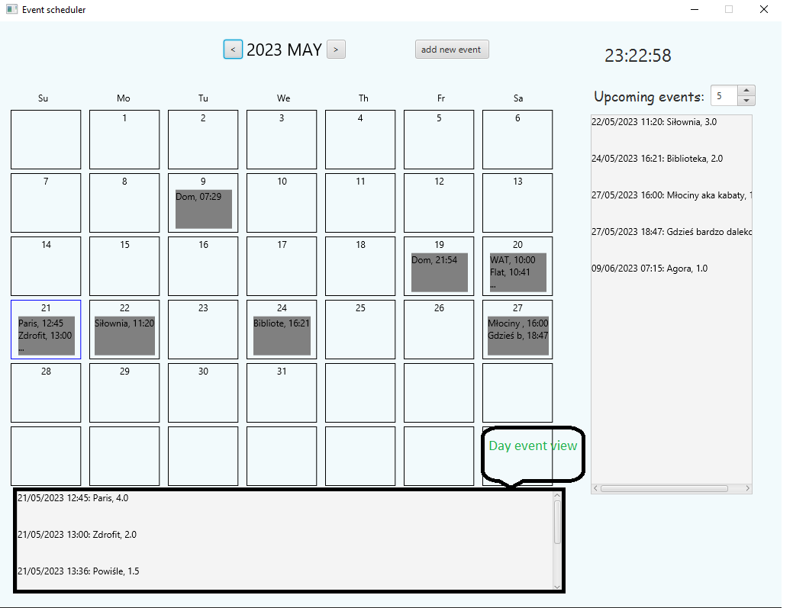
Users can click on 'Add event' to create a new event: 
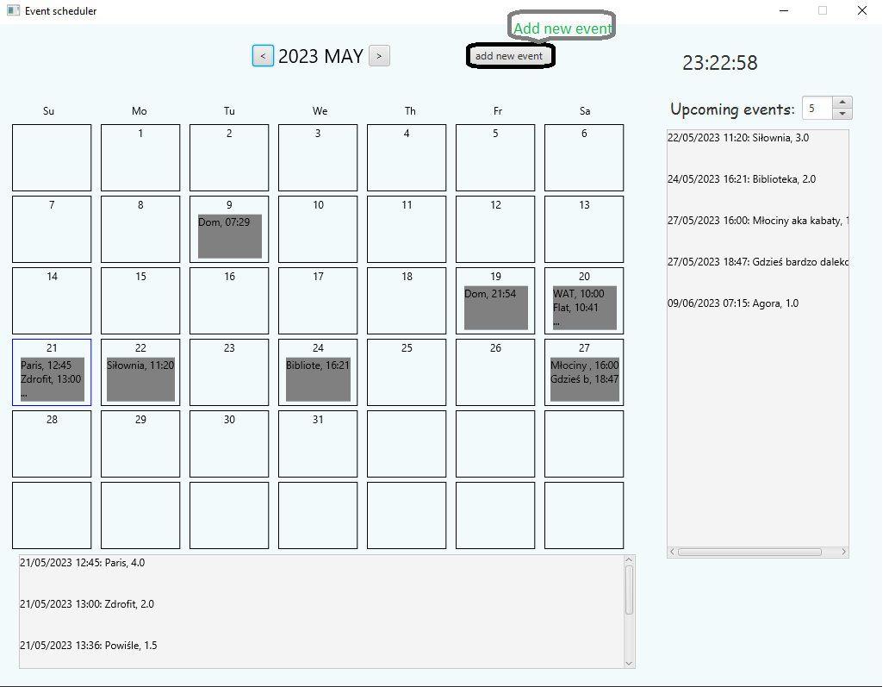.
Event view contains form for creating new event: 
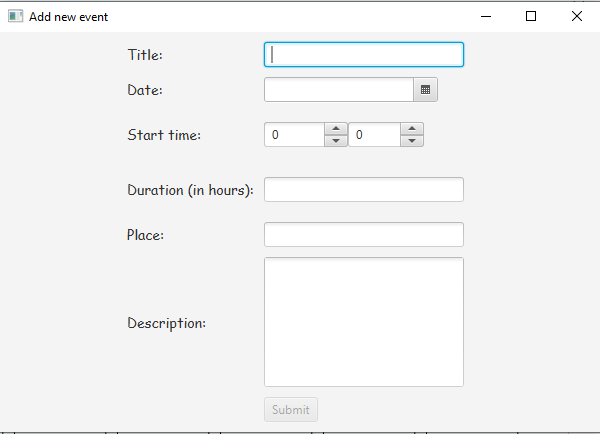
After filling the form with proper data, user can click on 'Submit' to create new event: 
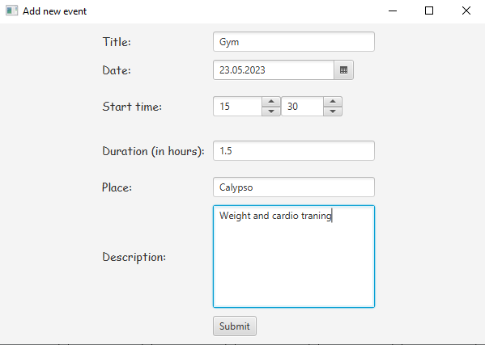
Automatically, new event will be added to the calendar view: 
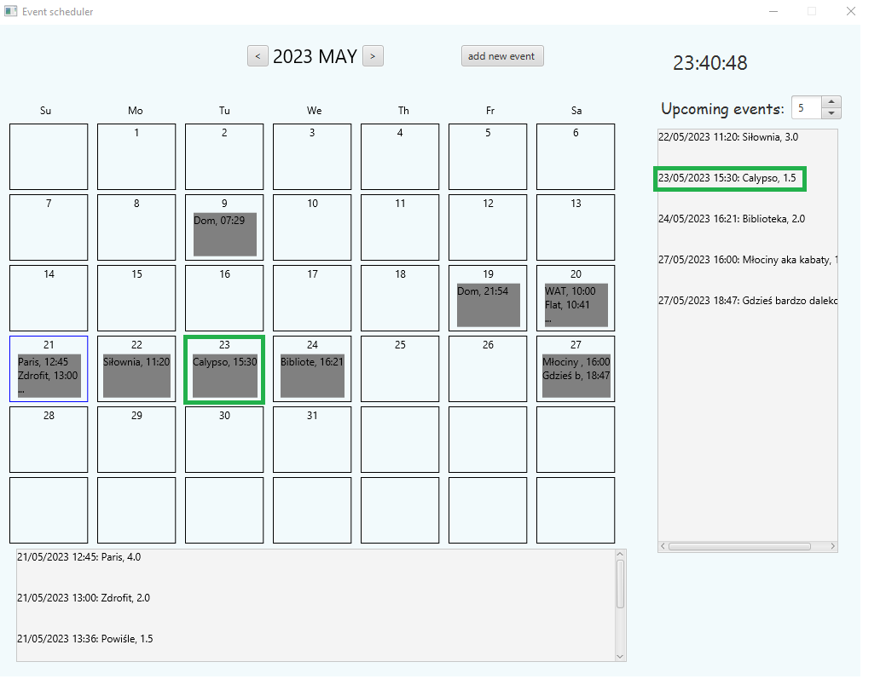
To view event details, user can click on any of the text with event: 
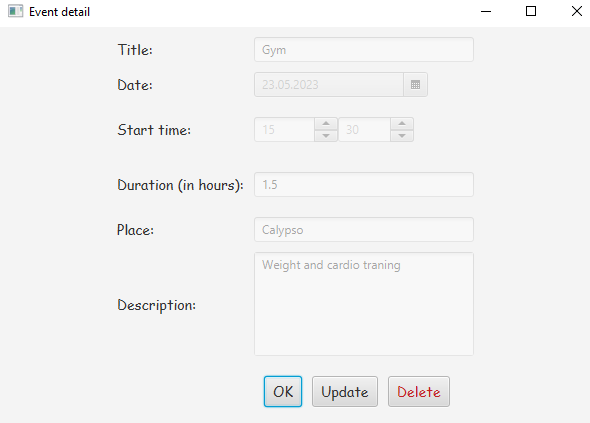
In event view user can see event details and update or delete event: 
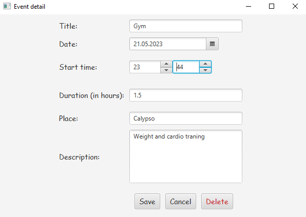
After updating event, user can see updated event in calendar view: 
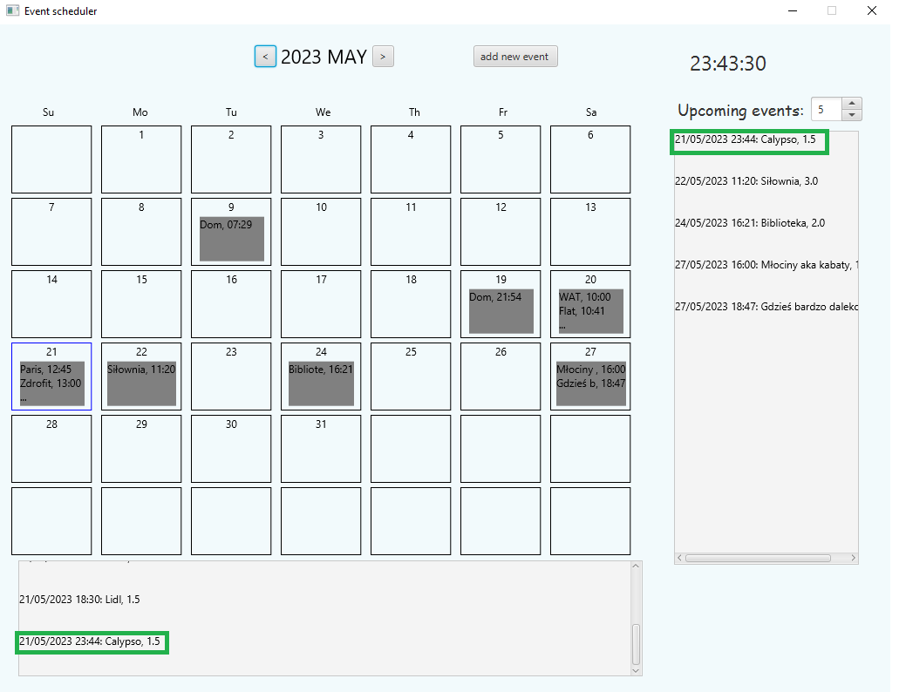
When the event begins, the application will display a notification: 
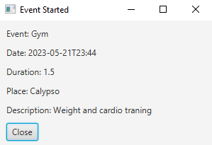

## The technology stack

This project is implemented with Java version 17 and JavaFX version 17.0.1.
The mongoDB database is used to store event data. Database connection is established using the mongodb-java-driver version 4.9.0.
The project is built using Maven. For more information about the dependencies, please refer to the pom.xml file.

## Architecture

We use the Model-View-Controller (MVC) architecture for the Event Scheduler project.
The EventManager class acts as the model, which stores the event data and provides methods for accessing and modifying the data.
The CalendarController class acts as the controller, which handles user interactions with the calendar view and updates the view based on changes in the event data.
The EventModel class represents an individual event and provides methods for accessing and modifying the event attributes.
The EventController class is responsible for managing the event creation window.
The EventDetailController class handles the event detail window, which displays information about a specific event.
The ConnectionDB class is responsible for connecting to the mongoDB database.
All view components are implemented using FXML files.

### Diagrams

The following diagram shows the class diagram for the Event Scheduler project:
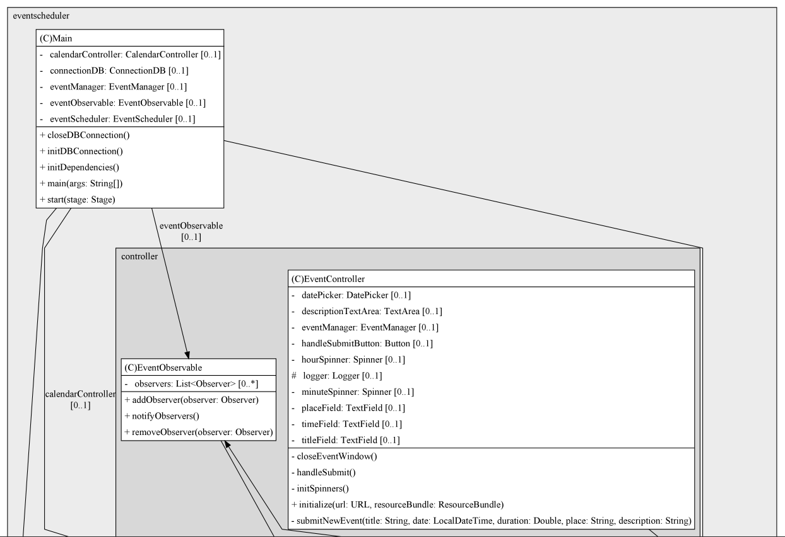
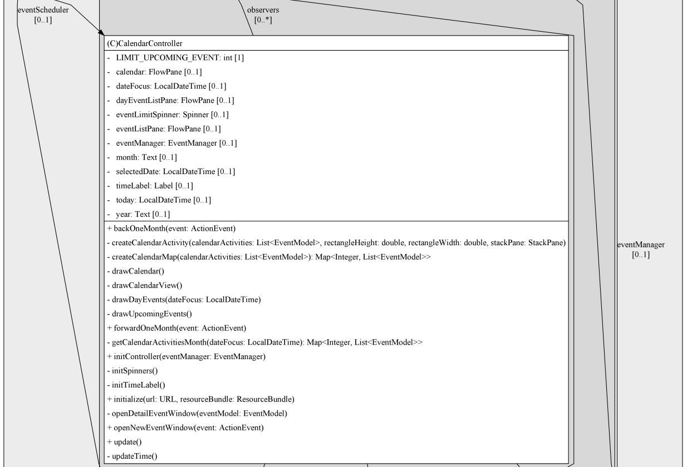
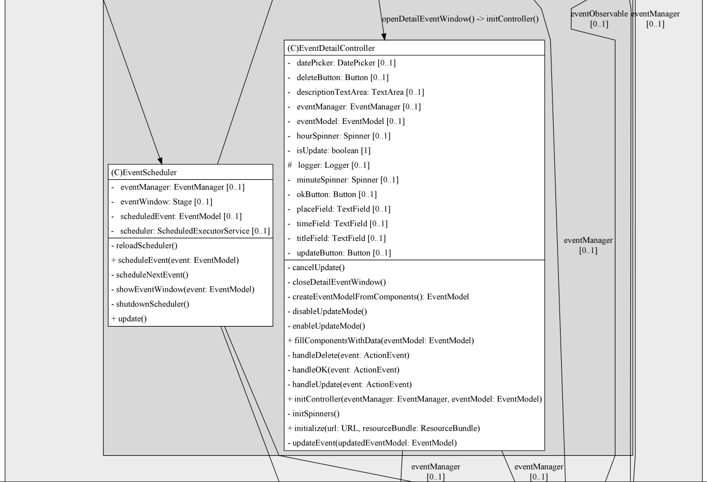
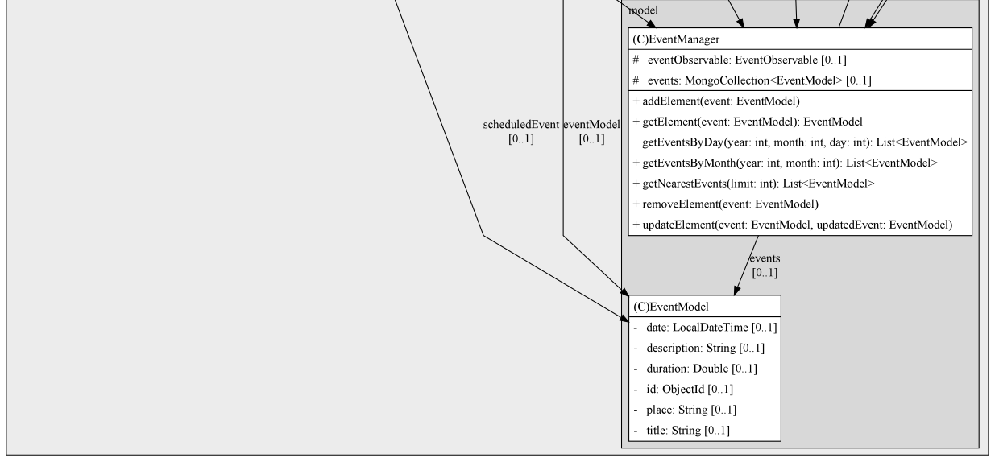

Note: The class diagram was generated using the [PlantUML Diagram Generator](https://plugins.jetbrains.com/plugin/15991-plantuml-diagram-generator) plugin for IntelliJ.

### Documentation

The documentation for the Event Scheduler project is available in the docs directory.
The main documentation file is [docs/index.html](docs/index.html).
